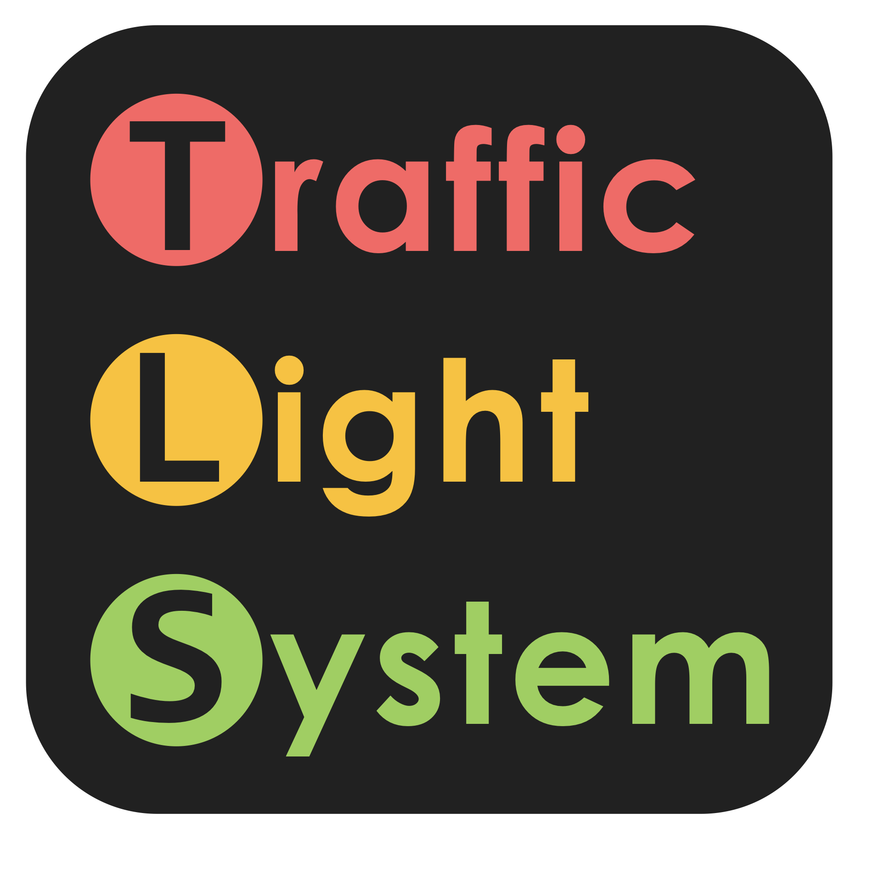

# Traffic-Improvement



Sixth Form Raspberry Pi Project for PAConsulting.com

## Summary

Traffic-Improvement is software used to reduce waiting times at a traffic light system by comparing many factors that affect traffic flow, and then calculating the most efficient traffic light cycle timings to use. The Raspberry Pi is used to control the traffic lights, and runs a web interface that allows an engineer to change variables for that traffic system.

The inspiration for the project originated from the number of traffic lights at roadworks in our area. We noticed that drivers would be waiting for extended periods of time at lights, and in some cases just to have no cars going past before the lights would change.

This project aims to reduce the waiting time for drivers at traffic lights by using the optimum timings on the traffic light depending on the conditions. As a result, drivers will feel more positive when travelling and it will reduce traffic build-up at roadworks.

Firstly, we gathered information on current traffic statistics in the UK, from government sources. Furthermore, we researched into other factors that affect traffic flow, such as:

- human reaction time
- distraction chance
- weather effects
- probability of traffic

By combining these factors, we could determine the average waiting time of vehicles in the system for different road usages and traffic light timings. The first part of the software simulates the traffic system with these variables to return an average waiting for all the vehicles. We then plot these on a 3D graph which would then reveal the most efficient timings for different traffic levels for the fastest experience.

The web interface is powered by Python Flask. This site is used by the traffic engineers to generate a simulation of the current traffic conditions at their location, which will then determine and display the most efficient timings for the traffic lights.

Currently, the project generates a graph based on many variables, some of which the user can change through the interface. However, there are many improvements we would implement into future versions to make the project viable for use in the real world.

Our first major improvement would be to use number plate recognition technology through image detection using a Raspberry Pi camera. This could let the simulation determine different timings for different vehicle types that are found in the traffic light system.

Secondly, GPS modules for the Raspberry Pi could be used in order to calculate accurate distances between the lights. Our code currently uses fixed vector positions for the traffic lights, therefore implementing an automatic system to calculate the vectors based on the geographical position of the traffic lights would be more convenient.

Finally, another improvement would be automatic updates of the traffic light timings. The code would use the GPIO pins on the Raspberry Pi to control an external board which would change the colours on the traffic light. This would mean the engineer would only have to input the traffic conditions and the software would do the rest of the work.

## Proof of Working

**Please watch our video on YouTube where we explain how the project works: [https://youtu.be/tiH4ZLpnVOU](https://youtu.be/tiH4ZLpnVOU)**

Here are some images of the project:

- 3D Graph displaying average waiting time for different road traffic levels and green light times


- Flask Web Interface


## Software & Hardware

**Software Used:** All software listed is free.

- Visual Studio Code.

  - Python 3.6

    - Flask module for Web Interface.
    - Simpy and other modules for simulation.
    - MatPlotLib module for graphs.
  - HTML + CSS for Web Interface.
- PuTTY (for SSH connection to Raspberry Pi).

**Hardware Used:**

- Raspberry Pi Model 3 B

## Instructions

### Hardware Setup

1. Setup the Raspberry Pi in headless mode. _Follow this guide [here](https://caffinc.github.io/2016/12/raspberry-pi-3-headless/)._

2. Connect to the Raspberry Pi using PuTTY or any other SSH software.

3. Install `git`,`python3`,`python3-pip`, and `screen`:

  ```bash
  sudo apt-get update
  sudo apt-get upgrade
  sudo apt-get install git python3 python3-pip screen
  ```

4. Clone this repository:

  ```bash
  git clone https://github.com/mitgobla/Traffic-Improvement TrafficImprovement
  cd TrafficImprovement
  ```

5. Install the required Python modules in `requirements.txt`:

  ```bash
  cd Traffic-Light-Management
  sudo python3 -m pip install -r requirements.txt
  ```

## Software Setup

1. Find out the IP address of the Raspberry Pi. Record it for use later.

  ```bash
  hostname -I
  ```

2. Create a new screen instance so the code can run after you have disconnected.

  ```bash
  screen bash
  # You should now be on a blank terminal
  ```

3. Simply run `main.py` using Python.

  ```bash
  # Make sure you're in the Traffic-Light-Management directory.
  python main.py
  ```

4. You should see in terminal this output:

  ```bash
  # ...
  Debugger PIN: XXX-XXX-XXX
  Running on http://0.0.0.0:80/ Press (CTRL+C to quit)
  ```

5. On a web browser on a device that is connected to the same network as the Raspberry Pi, navigate to the IP address you recorded earlier (the IP address of the Raspberry Pi).

6. The web interface to configure the simulation should appear.

## Media

- [PA Consulting Insight 2019 Article](https://www.paconsulting.com/insights/live-pa-raspberry-pi-2019-competition/)
- [PA Consulting PAPiAwards19 Video](https://youtu.be/yoUBW6hDl_M)
- [Tivy-Side Advertiser](https://www.tivysideadvertiser.co.uk/news/17643925.newcastle-emlyn-school-pupils-win-top-award/)
- [E&T Article](https://eandt.theiet.org/content/articles/2019/05/raspberry-pi-innovations-unveiled-by-british-youngsters/)
- [newelectronics Article](https://www.newelectronics.co.uk/electronics-news/pa-consulting-national-school-raspberry-pi-competition-winners-announced/214812/)
- [ElectronicsWeekly Article](https://www.electronicsweekly.com/news/products/raspberry-pi-development/pas-raspberry-pi-schools-competition-tackles-transport-2019-05/)
- [Ysgol Gyfun Emlyn Article](https://ysgolgyfunemlyn.org.uk/news/team-lightning-strike-again/)

## Authors

Edward Upton ([engiego](https://www.github.com/engiego))

Ben Dodd ([mitgobla](https://www.github.com/mitgobla))
